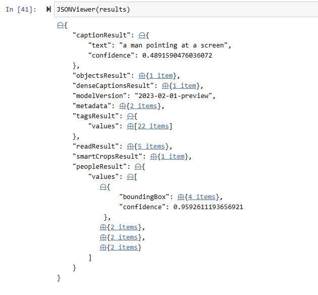

#  Azure Computer Vision Image Analysis V4.0

The Azure Computer Vision Image Analysis service 4.0 can extract a wide variety of visual features from your images. For example, it can determine whether an image contains adult content, find specific brands or objects, or find human faces.

**Available features = tags, objects, caption, read, smartCrops, denseCaptions, people**

The latest version of Image Analysis, 4.0, which is now in public preview, has new features like synchronous OCR and people detection. We recommend you use this version going forward.

You can use Image Analysis through a client library SDK or by calling the REST API directly. Follow the quickstart to get started.

https://learn.microsoft.com/en-us/azure/cognitive-services/computer-vision/overview-image-analysis?tabs=4-0

## Python demo notebook
<a href="https://github.com/retkowsky/Image-Analysis-with-Azure-Computer-Vision-4.0/blob/main/Image%20Analysis%20V4.0.ipynb">Python demo notebook</a>

## Results

14-Mar-2023 Serge Retkowsky | serge.retkowsky@microsoft.com | https://www.linkedin.com/in/serger/
